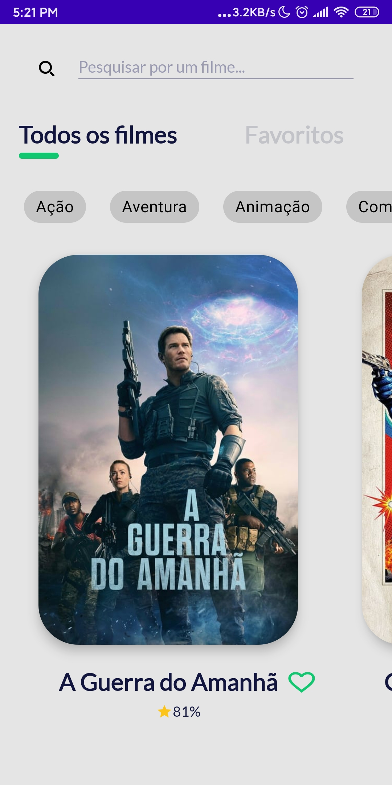
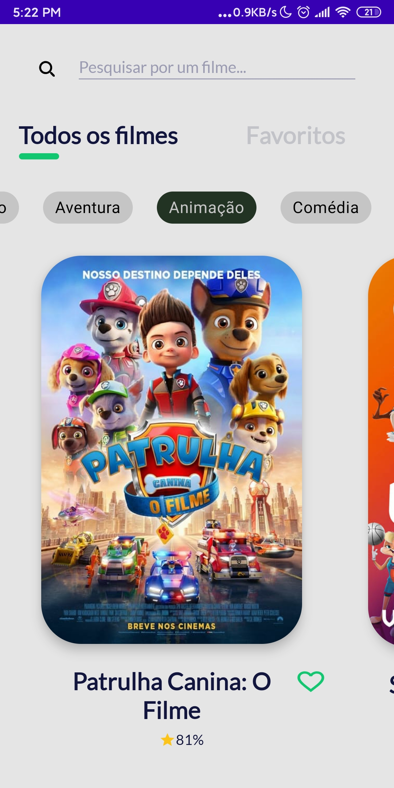
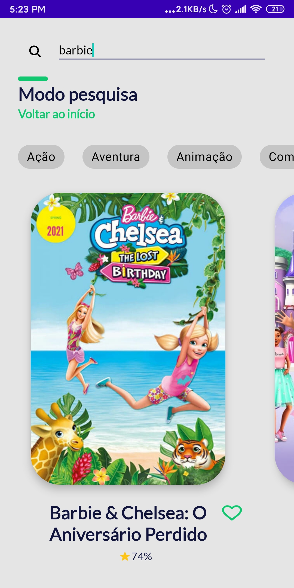
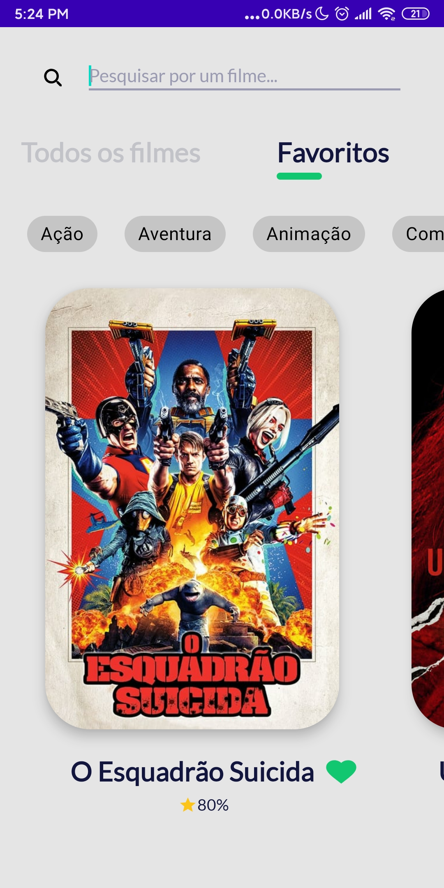
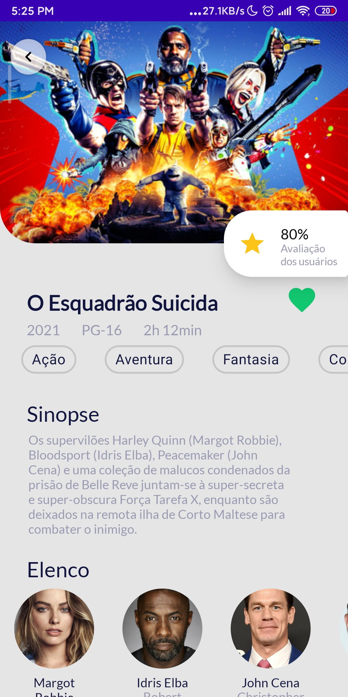
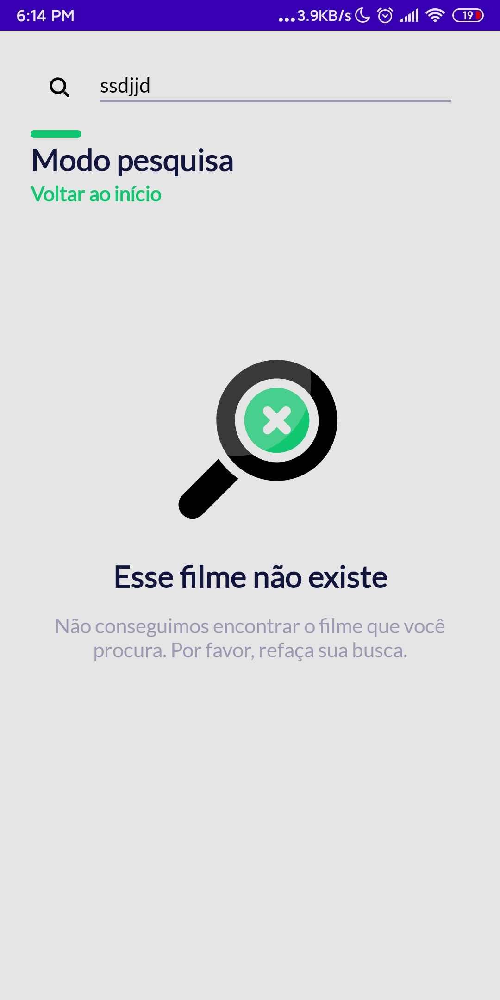
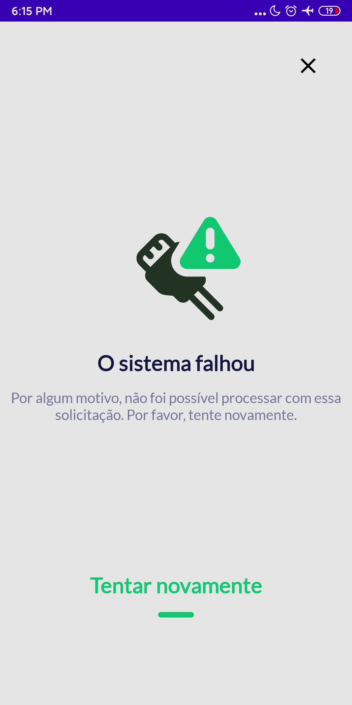

<h1 align= "center">Movies App: Vitória Code 2021</h1>

### 🎬 About de project
This is an Android application made in Kotlin that provides users with a list of movies using The Movie Database API database. On the app, users can favorite movies (saving them locally on their phones), filter movies by one or more genres, search for movies and see the details of any selected movie.

## 📱 Images
<h1 align="center">
 

 
 
 
 
 
 
 
 

</h1>

## 👩‍💻 Technologies and tools used:
- Retrofit
- RxJava
- Room Database
- Crashlytics
- Constraint Layout
- JUnit (unit tests)
- Espresso (instrumented tests)
- MVVM & Clean Architecture
